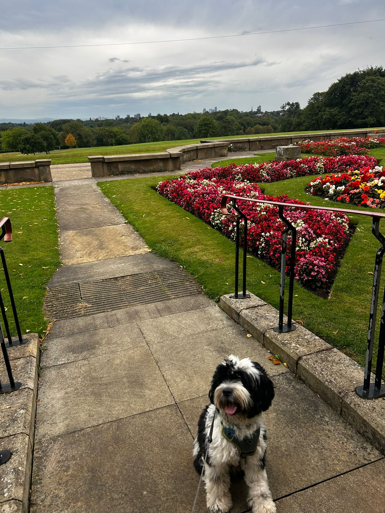

# K9 Kmeans
[](https://github.com/sdysch/k9-kmeans/actions/workflows/install.yml)

Fun (hopefully) side project clustering the far too many photos that I have of my dog
## Install
```bash
conda create -n k9kmeans python=3.12
conda activate k9kmeans
pip install -e .
```

### Install optional dependencies
```bash
pip install -e '.[dev]'
```

# Running pipeline
## Embeddings
Just one model used so far, but could easily be extended to use others
```bash
python -m k9kmeans.pipeline.embeddings --outfile data/embeddings_all.parquet --image_dir images
```
## Clustering experiments
### KMeans
```bash
# for example
python -m k9kmeans.clustering.kmeans --outdir data/test_kmeans_experiment --embeddings_file data/embeddings_all.parquet --n_clusters 5
```
### DBScan
```bash
# for example
python -m k9kmeans.clustering.dbscan --outdir data/test_dbscan_experiment --embeddings_file data/embeddings_all.parquet --eps 0.5 --min_samples 5 --metric 'cosine'
```
## Visualisation
```
run_dashboard --csv data/results_initial.csv
# or
streamlit run src/k9kmeans/app/dashboard.py -- --csv data/results_initial.csv
```

where `data/results_initial.csv` is a CSV file with the following columns:
- `filepath`: full path to the image file
- `cluster`: cluster label assigned to this image

TODO: Add explanation of scatter plots, silhouette score, etc


## TODO
- [ ] Cleanup:
	- [ ] Pictures of Max with other dogs:
		- [ ] Initially cleanup by manually selecting pictures of just Max
		- [ ] Stretch goal would be to use a pre-trained model to identify pictures of multiple dogs, and filter these out
- [o] Clustering:
	- [o] Experiment with different clustering algorithms:
		- [X] kmeans
		- [X] DBSCAN
		- [ ] spectral clustering?
- [o] Dimensionality reduction:
	- [o] Experiment with different techniques, not just PCA
		- [X] t-SNE
		- [ ] UMAP
- [ ] Add CI tests for core functions
- [ ] Derive classes in src//k9kmeans/clustering from a common base class, as they are all essentially doing the same thing, would make interface easier. Probably overkill
- [o] Cluster evaluation:
	- [X] Add script to collapse cluster dimensions and plot
	- [X] Add script to loop over multiple experiments and make plots
	- [ ] Include metrics like silhouette score, elbow plot for kmeans, etc
	- [ ] Number of points/cluster (how many are noise according to dbscan?)


